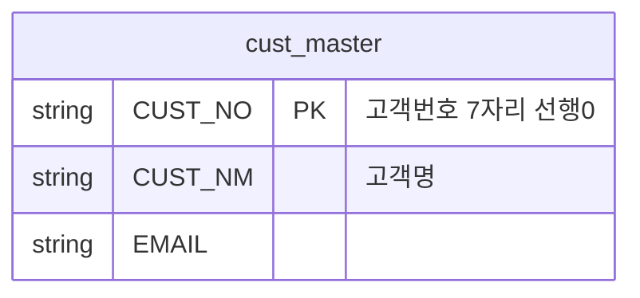

# 2026-10-07 데이터 표준화 · Mermaid · 모델링 수업 기록

> 과정 기준: 24일차 · 2026-10-07(수)

> 수업 자료와 당시 메모를 바탕으로 다시 공부할 수 있도록 정리한 기록이다.  
> 특히 오후에 처음 접해서 계속 헷갈렸던 **Mermaid(머메이드)** 와 데이터 모델링 흐름을 별도로 남긴다.  
> 아직 익숙하지 않은 개념이 많아 **이해 완료가 아니라 복습 기준을 만드는 기록**이다.

---

## 1. 오늘 수업의 전체 흐름

오늘 배운 내용을 크게 연결하면 다음과 같다.

```text
원천 데이터 확인
    ↓
데이터의 의미와 문제 파악
    ↓
표준화
    ↓
Grain / Key / Relation 확인
    ↓
AS-IS 모델링
    ↓
문제점 확인
    ↓
TO-BE 모델링
    ↓
실제 DB 구조로 구현
```

중요한 점은 단순히 코드를 실행하는 것이 아니라,

> **데이터가 실제 업무에서 무엇을 의미하는지 이해한 뒤 구조를 만드는 것**

이다.

---

## 원천 파일을 읽을 때 먼저 확인한 것

수업 앞부분에서는 코드를 쓰기 전에 **데이터의 의미와 파일 자체의 상태를 먼저 확인해야 한다**는 흐름을 다뤘다.

```text
주문 파일의 한 행은 무엇을 뜻하는지
AMT와 unitPrice는 왜 다른지
DLV_FEE는 왜 반복되는지
이 프로젝트의 기준일은 언제인지
BASE(기준 경로)는 어디인지
```

특히 Pandas가 CSV를 읽으면서 숫자처럼 보이는 값을 자동으로 숫자형으로 바꿀 수 있기 때문에, 고객번호처럼 선행 0이 중요한 식별자는 문자열로 읽어야 한다는 점을 확인했다.

---

## Encoding(인코딩)과 파일 깨짐

수업 메모에 나온 인코딩 관련 키워드:

```text
EUC-KR
UTF-8
CP949
BOM(Byte Order Mark)
utf-8-sig
```

같은 한글 데이터라도 저장·전송 환경이 달라지면 글자가 깨질 수 있기 때문에 **파일이 어떤 인코딩으로 저장되어 있는지 확인하는 습관**이 필요했다.

또 파일을 옮기거나 다른 시스템에서 읽을 때도 같은 언어 데이터가 깨질 수 있다는 점을 확인했다.

---

## JSON 구조와 데이터프레임 확인

JSON에서는 Key(키)와 Value(값) 구조를 확인하고, 이를 DataFrame(데이터프레임) 형태로 펼쳐서 행과 열이 정상적으로 만들어졌는지 확인했다.

수업 메모에는 API의 업무 활용 가이드, 표준 사전, 전후 비교, E2E(End to End) 같은 용어도 함께 등장했다.

여기서 중요한 흐름은:

```text
원천 값 확인
→ 구조 확인
→ DataFrame으로 펼치기
→ 전후 비교
→ 파일 출력
→ 원천과 다시 대조
```

였다.

---

## 데이터 표준화와 품질 기준

표준화에서는 다음 흐름을 수업 자료 기준으로 정리했다.

```text
표준 단어
→ 표준 용어
→ 표준 도메인
→ 표준 코드
```

그리고 데이터 품질의 6대 차원으로 다음 항목을 확인했다.

```text
완전성
유일성
유효성
일관성
정확성
적시성
```

수업에서는 중복 제거를 유일성과 연결해서 보고, 형식·허용값은 정규표현식과 스키마/제약조건으로 확인하는 흐름도 다뤘다.

---

# 2. 데이터 표준화

데이터마다 이름과 표현 방식이 제각각이면  
서로 같은 의미인지 판단하기 어렵다.

따라서 데이터에서 사용하는 단어와 용어를 일정한 규칙으로 맞춘다.

## 기본 흐름

```text
표준 단어
    ↓
표준 용어
    ↓
도메인
    ↓
표준 코드
```

예:

```text
회원 + 등급
    ↓
회원등급
    ↓
VARCHAR(1)
    ↓
A / B / C
```

### 표준 단어

더 작은 의미로 나누기 어려운 기본 단위.

예:

```text
회원
등급
주문
번호
상태
```

### 표준 용어

표준 단어를 조합하여 실제 업무에서 사용하는 이름을 만든다.

예:

```text
회원 + 등급 → 회원등급
주문 + 번호 → 주문번호
```

### 도메인

데이터가 어떤 형태와 범위를 가지는지 정의한다.

예:

```text
VARCHAR(7)
VARCHAR(1)
INT
DATE
```

즉,

> **도메인 = 이 데이터를 어떤 형태의 값으로 관리할 것인가**

라고 이해했다.

### 표준 코드

정해진 값 중 하나만 사용하도록 정의한 값.

예:

```text
회원등급
A / B / C

사용여부
Y / N
```

---

# 3. 도메인이라는 단어의 두 가지 사용

수업 중 `도메인`이라는 표현이 두 가지 의미로 사용되어 헷갈렸다.

## 데이터 표준화에서의 도메인

```text
고객번호 → VARCHAR(7)
```

자료형, 길이, 허용 범위 등의 의미.

---

## 업무 도메인 지식

데이터가 실제 업무에서 어떤 의미를 가지는지 아는 것.

예를 들어 주문 데이터에 배송비가 각 행마다 반복되어 있다고 해서  
모든 행의 배송비를 합산하면 안 된다.

업무 규칙이

> **배송비는 주문 한 건당 한 번만 발생한다**

라면 주문번호 기준으로 한 번만 계산해야 한다.

따라서 코드만 볼 것이 아니라  
**실제 업무 규칙을 알아야 정확한 계산을 할 수 있다.**

---

# 4. Grain

오늘 가장 중요하게 반복해서 나온 개념 중 하나.

## Grain이란?

> **테이블의 한 행이 무엇을 의미하는가**

를 말한다.

예:

```text
고객 테이블
→ 한 행 = 고객 한 명

상품 테이블
→ 한 행 = 상품 하나

주문 상세 데이터
→ 한 행 = 주문 안의 상품 한 줄
```

---

## 행 개수와 주문 건수는 다를 수 있다

수업에서 확인한 예:

```text
전체 행 수 = 3,952
ORD_NO 고유값 = 1,500
```

즉,

```text
3,952행 = 주문 3,952건
```

이 아니다.

하나의 주문에 여러 상품이 존재하기 때문에  
같은 주문번호가 여러 행에 반복될 수 있다.

따라서 주문 건수를 구하려면  
단순한 행 개수가 아니라 **ORD_NO의 고유값 개수**를 확인해야 한다.

---

# 5. 배송비가 부풀려지는 문제

같은 주문 안에 상품이 여러 개 있으면  
배송비도 여러 행에 반복되어 저장되어 있을 수 있다.

예:

```text
ORD_NO   상품     배송비
1001     상품A    3000
1001     상품B    3000
1001     상품C    3000
```

행 기준으로 모두 더하면:

```text
3000 + 3000 + 3000 = 9000
```

하지만 실제 배송비가 주문당 한 번이라면:

```text
실제 배송비 = 3000
```

따라서 주문번호 기준 중복을 제거한 뒤 계산해야 한다.

수업에서는 행 기준 계산과 주문 기준 계산 사이에  
큰 차이가 발생하는 것도 확인했다.

이 사례를 통해

> **Grain과 업무 규칙을 모르고 집계하면 결과가 틀릴 수 있다**

는 점을 확인했다.

---

# 6. Key 후보 확인

식별자로 사용할 수 있는 컬럼인지 확인하는 작업도 진행했다.

기본 조건:

```text
NOT NULL
+
UNIQUE
```

즉,

> 비어 있지 않고 중복되지 않아야 식별자 후보가 될 수 있다.

예:

```text
CUST_NO
빈 값 0
중복 0
→ 식별자 후보 가능
```

반면:

```text
HP
중복 존재
→ 식별자 후보로 부적합
```

---

## 코드 검사만 믿으면 안 되는 이유

`CUST_NM`이 현재 데이터에서 우연히 중복이 없을 수도 있다.

하지만 사람 이름은 동명이인이 존재할 수 있으므로  
업무적으로 안정적인 식별자가 아니다.

따라서:

```text
코드로 후보 확인
    ↓
업무 의미를 사람이 판단
```

하는 과정이 필요하다.

---

# 7. 반복값을 이용한 코드 후보 찾기

컬럼의 고유값 수를 확인해  
종류가 적게 반복되는 값을 찾아보았다.

예:

```text
PAY_MTHD
CARD / BANK / MOBILE ...

useYn
Y / N

currency
KRW / USD
```

이런 값은 코드성 데이터일 가능성이 높다.

하지만 고유값 종류가 적다고 모두 코드인 것은 아니다.

예:

```text
DLV_FEE
0 / 2500 / 3000 / 5000 ...
```

종류는 적지만 이것은 코드가 아니라 **실제 금액 값**이다.

따라서 여기서도:

> **프로그램은 후보를 찾아줄 수 있지만 최종 의미 판단은 사람이 해야 한다.**

---

# 8. 데이터 모델

수업에서 모델은 꼭 데이터베이스만 의미하는 것이 아니라

```text
그림
3차원 대상체
테이블
다이어그램
```

처럼 어떤 대상을 눈에 보이게 표현한 것도 모델이라고 설명했다.

데이터 모델링에서는 현실의 정보를  
구조적으로 표현한다.

예:

```text
고객
주문
상품
```

---

# 9. 개념 / 논리 / 물리 모델

## 개념 모델

큰 대상을 찾는 단계.

```text
고객
주문
상품
```

즉,

> **무엇이 존재하는가**

를 보는 단계.

---

## 논리 모델

대상 간 구조와 관계를 구체화한다.

예:

```text
고객 1명
    ↓
주문 여러 건
```

`1 : N`처럼 관계에 숫자와 규칙이 들어가기 시작하면  
개념 모델보다 더 구체적인 논리 모델로 볼 수 있다.

즉,

> **어떤 구조와 관계를 가지는가**

를 정리하는 단계.

---

## 물리 모델

실제로 DB에 구현할 수 있는 형태로 구체화한다.

예:

```text
CUST_NO VARCHAR(7)
PK
FK
TABLE NAME
INDEX
```

즉,

> **실제 DB에서 어떻게 만들 것인가**

를 정하는 단계.

---

## 한 줄 정리

```text
개념 = 대상 찾기
논리 = 구조와 관계 정리
물리 = 실제 구현
```

---

# 10. 역공학

오늘 수업에서는 이미 존재하는 원천 데이터를 보고  
현재 구조를 거꾸로 추론했다.

일반적인 방향은:

```text
요구사항
→ 설계
→ DB
```

하지만 현재 실습은:

```text
기존 데이터
→ 구조 분석
→ 규칙 추론
→ 모델 복원
```

형태였다.

이런 방식이 **Reverse Engineering(역공학)** 과 연결된다.

---

# 11. AS-IS / TO-BE

## AS-IS

현재 데이터가 실제로 어떤 상태인지 표현한다.

> **현재 모습 그대로**

예:

```text
cust_master
order_2026
product_api_response
```

현재 컬럼과 문제점을 그대로 확인한다.

---

## TO-BE

AS-IS에서 발견한 문제를 개선하여  
앞으로 사용할 구조를 설계한다.

즉:

```text
AS-IS
현재 구조 확인
    ↓
문제점 발견
    ↓
TO-BE
개선된 구조 설계
```

---

# 12. Mermaid(머메이드)

### 당시 실습 화면


당시 메모에 실제로 **“머메이드???????”** 라고 적을 정도로 처음에는 무엇인지부터 생소했다.

Mermaid는 글자로 다이어그램을 작성하는 방법이다.

예:

```text
erDiagram
    CUSTOMER ||--o{ ORDER : places
```

코드로 작성하면  
Markdown 미리보기에서 ERD 형태로 시각화할 수 있다.

---

## 엔터티 작성 예



단순한 컬럼 목록뿐만 아니라  
PK나 컬럼에 대한 설명도 함께 기록할 수 있다.

---

# 13. Mermaid 관계 기호

오늘 받은 관계 표에서 확인한 내용.

```text
||  = 정확히 1

o|  = 0 또는 1

|{  = 1개 이상

o{  = 0개 이상
```

예:

```text
CUSTOMER ||--o{ ORDER
```

고객 한 명과 여러 주문의 관계처럼 표현할 수 있다.

---

# 14. 점선과 실선 관계

AS-IS 모델에서는 데이터 값으로 관계가 추정되지만  
실제 DB의 FK로 보장되지 않을 수도 있다.

예:

```text
order_2026 }o..o| cust_master
```

점선 관계로 표현.

반면 TO-BE에서는  
PK/FK 등을 설계하여 DB가 관계를 보장하도록 만들 수 있다.

---

# 15. 오늘 작성한 AS-IS 모델

수업에서 다음 세 원천을 모델로 표현했다.

```text
cust_master
order_2026
product_api_response
```

관계:

```text
order_2026
    ↔ cust_master

order_2026
    ↔ product_api_response
```

현재 데이터의 문제도 모델에 설명으로 기록했다.

예:

```text
HP
→ 중복 존재

EMAIL
→ 빈 값 존재

ORD_NO
→ 단독 식별자 불가

DLV_FEE
→ 주문 단위 값이 항목마다 반복

taxType
→ 정의되지 않은 값 존재
```

---

# 16. 원천 데이터 정의서

원천 데이터 정의서는 각 데이터가

```text
무슨 의미인지
어떤 형식인지
어떤 문제가 있는지
```

기록한 문서다.

예:

```text
CUST_NO
→ 고객번호
→ 문자 7자리
→ 선행 0 존재

EMAIL
→ 결측값 존재

JOIN_DT
→ 날짜 형식 혼재
```

이 정보를 AS-IS 모델 작성의 근거로 사용할 수 있다.

---

# 17. QA

QA는 Quality Assurance의 약자.

오늘 수업에서는

> **데이터와 결과가 우리가 정한 규칙에 맞는지 확인하는 과정**

으로 이해했다.

예:

```text
PK 중복 확인
NULL 확인
관계 확인
집계 결과 확인
형식 확인
```

---

# 18. grain.py

수업에서 사용한 `grain.py`는 프레임워크가 아니라  
프로젝트 안에 작성된 Python 모듈이다.

예:

```python
from grain import grain_table, key_check, relation_check
```

`grain.py` 안에 있는 검사 함수를  
다른 Python 파일에서 불러와 사용하는 형태이다.

구분:

```text
Grain
→ 데이터 모델링 개념

grain.py
→ Grain / Key / Relation 등을 검사하기 위해 만든 Python 모듈
```

---

# 19. Medallion Architecture

수업 후반에 Medallion Architecture도 언급되었다.

기본적으로 데이터를 단계별로 관리한다.

```text
Bronze
→ 원본 데이터

Silver
→ 정제·표준화된 데이터

Gold
→ 분석이나 서비스에서 사용할 수 있도록 가공된 데이터
```

오늘 배운 흐름과 연결하면:

```text
원천 데이터
    ↓
정제 / 표준화 / 품질 검사
    ↓
모델링
    ↓
활용 가능한 데이터
```

라는 흐름으로 이해할 수 있다.

---

# 20. 오늘 수업에서 가장 중요하다고 느낀 점

코드를 실행해서 결과를 얻는 것만으로는 충분하지 않다.

예를 들어 프로그램은:

```text
중복이 없는 컬럼
고유값이 적은 컬럼
NULL이 있는 컬럼
```

등을 찾아줄 수 있다.

하지만

```text
이름을 PK로 써도 되는가?

배송비는 행마다 더해야 하는가?

고유값이 5개면 코드인가?

한 행은 주문인가 주문상품인가?
```

같은 문제는 데이터의 **업무 의미**를 알아야 판단할 수 있다.

따라서 오늘 수업의 핵심을 한 문장으로 정리하면:

> **데이터의 구조만 보는 것이 아니라, 한 행의 의미와 업무 규칙을 이해한 뒤 표준화·검증·모델링해야 한다.**

---

# 다시 복습할 것

아직 익숙하지 않은 부분:

- [ ] Grain을 보고 한 행의 의미 판단하기
- [ ] PK / FK 후보 판단하기
- [ ] 관계 기호 읽기
- [ ] AS-IS와 TO-BE 차이
- [ ] 개념 / 논리 / 물리 모델 구분
- [ ] Mermaid ERD 직접 작성하기
- [ ] 업무 도메인과 데이터 도메인 구분하기
- [ ] 반복값을 보고 코드인지 일반 값인지 판단하기
- [ ] 원천 데이터 정의서를 보고 모델링 근거 찾기

---

## 오늘의 한 줄 복습

```text
원천 데이터를 그대로 믿지 말고,
한 행의 의미와 업무 규칙을 확인한 뒤
현재 구조를 분석하고 더 나은 구조로 모델링한다.
```
