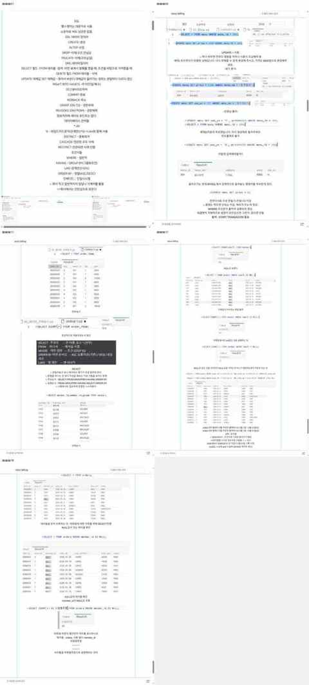

# 2026-10-08 SQL 기본 문법 · 데이터 조회 수업 기록

> 과정 기준: 25일차 · 2026-10-08(목)

> 25일차 수업 자료를 기준으로 정리한 복습 기록이다.  
> 이 날 자료의 중심은 **SQL 기본 문법, 조회, 조건식, 수정·취소, NULL, 날짜 조건**이었다.  
> SQL 명령어를 외웠다고 쓰기보다, 직접 쿼리를 다시 작성해 볼 수 있도록 문법과 주의점을 함께 정리했다.

## 전체 흐름

```text
SQL 명령어 분류
→ 데이터베이스 / 테이블 확인
→ CREATE
→ INSERT
→ SELECT
→ WHERE / ORDER BY / LIMIT
→ UPDATE / DELETE
→ TRANSACTION / ROLLBACK
→ NULL
→ 날짜 조건
```

## 수업 메모에서 먼저 정리한 SQL 키워드

수업 자료 첫 부분에는 다음 키워드가 한꺼번에 정리되어 있었다.

```text
*          → 전체(All)
%          → LIKE와 함께 쓰는 Wildcard(와일드카드)
DISTINCT   → 중복 제거
CASCADE    → 연관된 대상까지 함께 처리
RESTRICT   → 연관된 대상이 있으면 제한
WHERE      → 일반 조건
HAVING     → GROUP BY 이후 조건
ORDER BY   → 정렬
ASC / DESC → 오름차순 / 내림차순
```

또 SQL 명령어는 수업에서 대문자로 쓰는 형태를 주로 사용했지만, 소문자로 작성해도 실행에는 문제가 없다고 메모했다.

---

## 실습 화면



## SQL 명령어 분류

### DDL(Data Definition Language, 데이터 정의어)

구조를 만들거나 변경한다.

```sql
CREATE
ALTER
DROP
TRUNCATE
```

- CREATE: 생성
- ALTER: 구조 변경
- DROP: 구조까지 삭제
- TRUNCATE: 데이터 삭제, 테이블 구조는 유지

### DML(Data Manipulation Language, 데이터 조작어)

```sql
SELECT
INSERT
UPDATE
DELETE
```

- SELECT: 조회
- INSERT: 추가
- UPDATE: 수정
- DELETE: 삭제

### Transaction / 권한 관련

```sql
COMMIT
ROLLBACK
GRANT
REVOKE
```

## 기본 조회

```sql
SELECT VERSION();
SELECT NOW();
```

버전과 현재 시간을 확인했다.

## 별칭 AS

```sql
SELECT menu_name AS 메뉴명
FROM menu;
```

`AS`는 출력되는 Column 이름에 별칭을 붙인다.

## Database와 Table 확인

```sql
SHOW DATABASES;
SHOW TABLES;
DESC store;
SHOW CREATE TABLE store;
```

- `DESC`: 어떤 Column과 Type으로 구성되었는지 확인
- `SHOW CREATE TABLE`: 실제 CREATE 문 확인

## 주요 Data Type(자료형)

- `CHAR(n)`: 고정 길이 문자열
- `VARCHAR(n)`: 가변 길이 문자열
- `INT`: 정수
- `DECIMAL(10, 0)`: 정확한 숫자
- `DATE`: 날짜
- `DATETIME`: 날짜 + 시간

### utf8mb4

한글, 영문, Emoji(이모지) 등을 저장할 수 있는 문자 집합.

Collation(정렬 규칙)도 함께 확인했다.

## CREATE TABLE

```sql
CREATE TABLE store (
    store_id INT,
    store_name VARCHAR(100),
    region VARCHAR(30),
    opened_at DATE
);
```

테이블을 만든 뒤 반드시:

```sql
DESC store;
```

로 의도한 구조인지 확인한다.

## INSERT

### 한 행

```sql
INSERT INTO store (
    store_id,
    store_name,
    region,
    opened_at
)
VALUES (
    1,
    '별빛커피 강남점',
    '서울',
    '2024-03-01'
);
```

SQL에서는 날짜도 따옴표 안에 문자열 형태로 작성한다.

### 여러 행

```sql
INSERT INTO store (store_id, store_name, region, opened_at)
VALUES
(2, '별빛커피 홍대점', '서울', '2025-01-15'),
(3, '별빛커피 판교점', '경기', '2025-09-01');
```

## SELECT

### 전체 조회

```sql
SELECT *
FROM menu;
```

`*`는 모든 Column을 의미한다.

### 특정 Column

```sql
SELECT menu_name, price
FROM menu;
```

### DISTINCT

```sql
SELECT DISTINCT category
FROM menu;
```

중복을 제거한 고유값을 조회한다.

## 작성 순서와 실행 순서

수업에서 따로 구분해서 확인했다.

### 작성 순서

```text
SELECT
FROM
WHERE
GROUP BY
HAVING
ORDER BY
```

### 수업 메모에 적은 실행 순서

```text
FROM
→ GROUP BY
→ HAVING
→ SELECT
→ ORDER BY
```

당일 메모에는 위 순서로 적었고, WHERE는 별도의 조건식 파트에서 따로 연습했다.  
핵심은 **작성 순서와 실제 처리 흐름이 다르다**는 점을 다시 보는 것이다.

## ORDER BY

```sql
SELECT menu_name, price
FROM menu
ORDER BY price;
```

기본은 오름차순이다.

```sql
ORDER BY price DESC;
```

- ASC: 오름차순
- DESC: 내림차순

## LIMIT

```sql
SELECT *
FROM menu
LIMIT 5;
```

앞에서 5개 조회.

```sql
SELECT *
FROM menu
LIMIT 5 OFFSET 5;
```

앞의 5개를 건너뛰고 다음 5개를 조회하는 식으로 사용할 수 있다.

## WHERE 조건

### 숫자 비교

```sql
SELECT menu_name, price
FROM menu
WHERE price >= 5000
ORDER BY price;
```

### 문자열 비교

```sql
SELECT menu_name, price
FROM menu
WHERE category = '커피';
```

### 여러 조건

```sql
SELECT menu_name, price
FROM menu
WHERE category = '커피'
  AND price < 5000;
```

```sql
SELECT menu_name, price
FROM menu
WHERE category = '커피'
   OR category = '디저트';
```

### BETWEEN

```sql
SELECT menu_name, price
FROM menu
WHERE price BETWEEN 4500 AND 5500
ORDER BY price;
```

## LIKE와 Wildcard(와일드카드)

`%`는 여러 글자를 의미하는 Wildcard.

```sql
SELECT *
FROM member
WHERE member_name LIKE '김%';
```

성이 김인 회원처럼 문자열 패턴을 찾을 수 있다.

## UPDATE

```sql
UPDATE menu
SET price = 6500,
    sale_yn = 'Y'
WHERE menu_name = '호두파이';
```

가장 중요한 주의점:

> **WHERE 없이 UPDATE하면 모든 행이 변경될 수 있다.**

수업에서도 전체 가격을 잘못 바꾸는 상황을 예로 들어 위험성을 확인했다.

## Transaction과 ROLLBACK

Ctrl+Z처럼 되돌리는 것이 아니라 Transaction을 사용한다.

```sql
START TRANSACTION;

UPDATE menu
SET price = 0;

ROLLBACK;
```

- `ROLLBACK`: 변경 취소
- `COMMIT`: 변경 확정

즉, 위험한 수정 작업을 할 때는 Transaction 안에서 확인하는 습관이 필요하다.

## DELETE

```sql
DELETE FROM menu
WHERE menu_name = '에스프레소';
```

DELETE 역시 WHERE 조건을 빼면 여러 행이 삭제될 수 있으므로 주의해야 한다.

## 계산식

할인가 같은 값도 SELECT 안에서 계산할 수 있다.

```sql
SELECT
    price,
    discount_rate,
    price * (1 - discount_rate) AS discounted_price
FROM menu;
```

## NULL

이날 특히 다시 봐야 할 부분.

잘못된 방식:

```sql
WHERE email = NULL
```

NULL은 일반 값처럼 `=`로 비교하지 않는다.

올바른 방식:

```sql
WHERE email IS NULL
```

반대는:

```sql
WHERE email IS NOT NULL
```

## COUNT와 NULL

```sql
SELECT COUNT(*)
FROM member;
```

전체 행 개수.

```sql
SELECT COUNT(email)
FROM member;
```

특정 Column의 NULL은 제외하고 센다.

따라서 무엇을 세는지에 따라 결과가 달라질 수 있다.

## 날짜 조건

5월 데이터를 찾을 때:

```sql
WHERE ordered_at >= '2026-05-01'
  AND ordered_at <  '2026-06-01';
```

처럼 **다음 달 1일 미만**으로 잡는 방식이 안전하다.

```text
5월 1일 이상
AND
6월 1일 미만
```

`2026-05-31`까지만 지정하면 DATETIME의 시간값 때문에 5월 31일 일부 기록을 놓칠 수 있다.

## 비회원 주문 조회

회원번호가 NULL이면 비회원 주문으로 볼 수 있는 예제를 다뤘다.

```sql
SELECT *
FROM orders
WHERE member_id IS NULL;
```

개수:

```sql
SELECT COUNT(*) AS 비회원주문
FROM orders
WHERE member_id IS NULL;
```

## 다시 연습할 것

- [ ] DDL / DML 구분
- [ ] CREATE TABLE 직접 작성
- [ ] 여러 행 INSERT
- [ ] SELECT / DISTINCT
- [ ] WHERE에서 AND / OR
- [ ] LIKE와 %
- [ ] ORDER BY / LIMIT
- [ ] UPDATE 전에 WHERE 확인
- [ ] START TRANSACTION / ROLLBACK / COMMIT
- [ ] NULL은 IS NULL로 비교
- [ ] COUNT(*)와 COUNT(column)의 차이
- [ ] 날짜 범위를 다음 달 1일 미만으로 작성

> 답만 보고 넘어가는 것보다 직접 SQL을 작성하고 실행 결과를 확인하는 연습이 더 필요하다.
